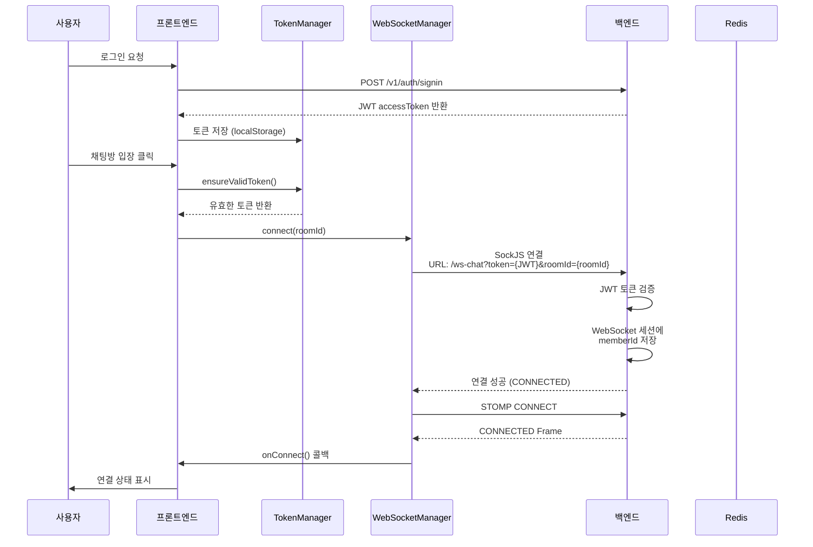
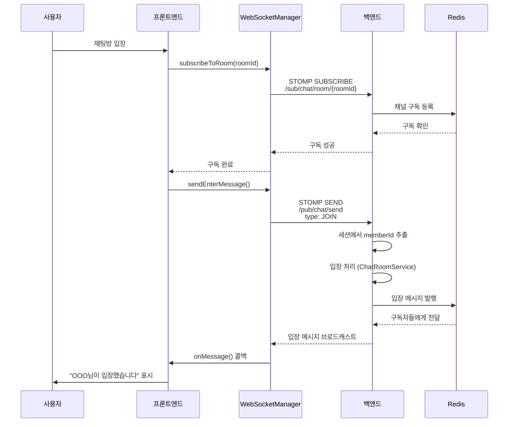
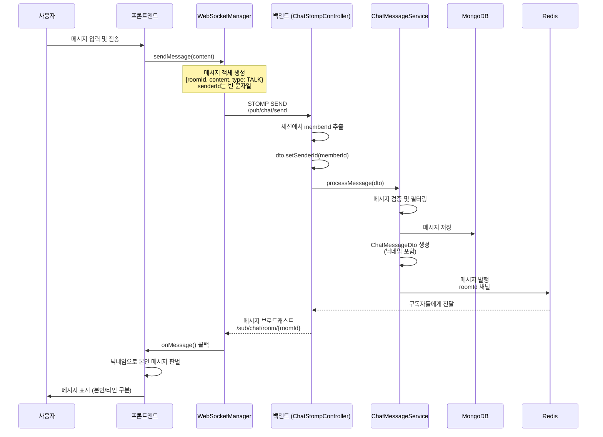
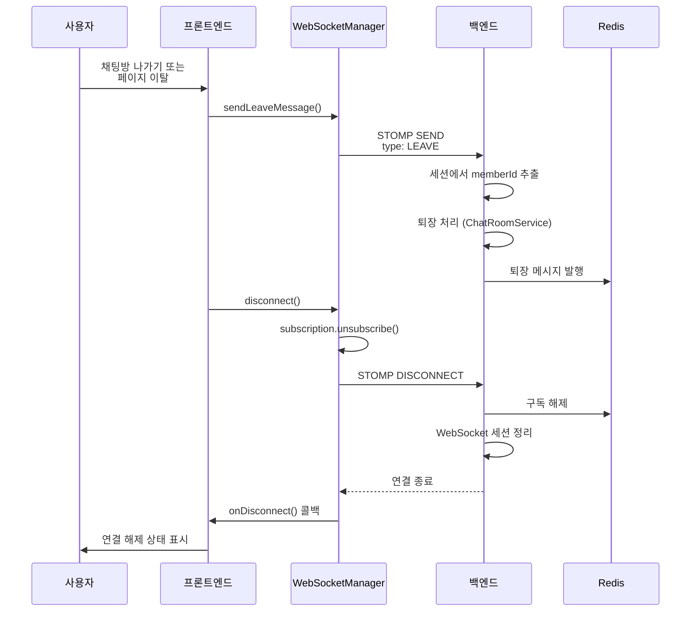
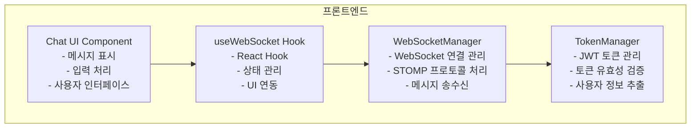
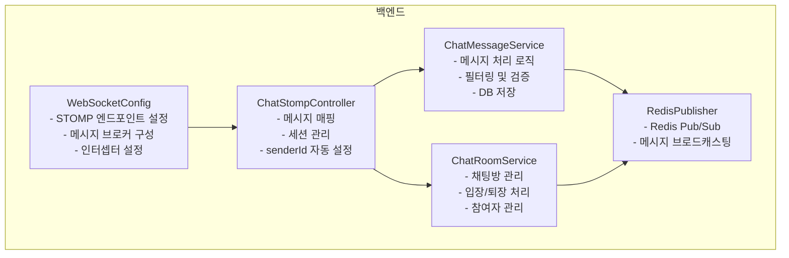
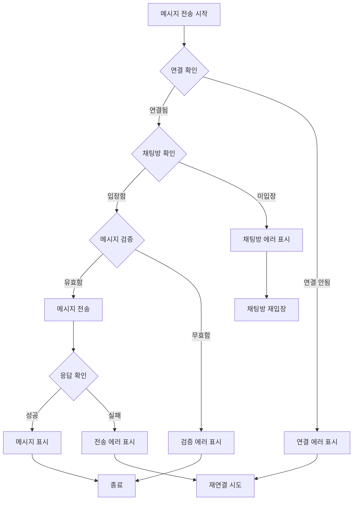

# WebSocket 채팅 연결 및 메시지 플로우

## 개요
DungeonTalk 프로젝트의 WebSocket 기반 실시간 채팅 시스템의 연결 및 메시지 전송 플로우를 설명합니다.

## 기술 스택
- **프론트엔드**: React (Remix), @stomp/stompjs, sockjs-client
- **백엔드**: Spring Boot, Spring WebSocket, STOMP
- **인증**: JWT (JSON Web Token)
- **메시지 브로커**: Redis Pub/Sub

## 1. WebSocket 연결 플로우



## 2. 채팅방 구독 플로우



## 3. 메시지 전송 플로우



## 4. WebSocket 연결 해제 플로우



## 5. 주요 구성 요소

### 프론트엔드 컴포넌트



### 백엔드 컴포넌트



## 6. 메시지 구조

### 클라이언트 → 서버 (전송)
```typescript
interface ChatMessageSend {
  roomId: string;        // 채팅방 ID
  senderId: '';         // 빈 문자열 (서버에서 자동 설정)
  content: string;      // 메시지 내용
  type: 'TALK' | 'JOIN' | 'LEAVE';
  senderNickname?: string;  // 닉네임 (표시용)
  createdAt: string;    // ISO 8601 형식
}
```

### 서버 → 클라이언트 (수신)
```typescript
interface ChatMessageReceive {
  messageId: string;    // 메시지 고유 ID
  roomId: string;       // 채팅방 ID
  senderId: string;     // 발신자 ID (서버 설정)
  senderNickname: string; // 발신자 닉네임
  content: string;      // 메시지 내용
  type: 'TALK' | 'JOIN' | 'LEAVE' | 'PRESENCE';
  createdAt: string;    // 생성 시간
  connectedCount?: number; // 접속자 수 (PRESENCE)
}
```

## 7. 보안 및 인증

### JWT 토큰 기반 인증
1. **연결 시점**: WebSocket 연결 시 쿼리 파라미터로 JWT 토큰 전달
   - URL: `/ws-chat?token={JWT}&roomId={roomId}`
2. **세션 관리**: 백엔드에서 WebSocket 세션에 memberId 저장
3. **메시지 전송**: 각 메시지마다 토큰 불필요 (세션 유지)

### 보안 특징
- **senderId 자동 설정**: 클라이언트가 senderId를 조작할 수 없음
- **세션 기반 인증**: 연결 시 한 번만 인증, 이후 세션으로 관리
- **데이터베이스 ID 미노출**: 프론트엔드에서 memberId 직접 사용 안 함

## 8. 에러 처리



## 9. 성능 최적화

### 프론트엔드
- **동적 Import**: SSR 환경에서 sockjs-client 동적 로딩
- **메시지 중복 방지**: messageId로 중복 체크
- **연결 재사용**: 싱글톤 WebSocketManager 인스턴스

### 백엔드
- **Redis Pub/Sub**: 효율적인 메시지 브로드캐스팅
- **세션 캐싱**: WebSocket 세션에 사용자 정보 캐싱
- **비동기 처리**: 메시지 처리 및 브로드캐스팅 비동기화

## 10. 트러블슈팅

### 일반적인 문제와 해결책

| 문제 | 원인 | 해결책 |
|------|------|--------|
| 메시지가 보이지 않음 | 구독 경로 불일치 | `/sub/chat/room/{roomId}` 경로 확인 |
| 본인 메시지 구분 안 됨 | senderId 불일치 | 닉네임으로 비교하도록 변경 |
| WebSocket 연결 실패 | 토큰 없음/만료 | TokenManager.ensureValidToken() 사용 |
| SSR 에러 | Node.js 모듈 import | 동적 import 사용 |
| 메시지 검증 실패 | senderId 필수 검증 | 백엔드에서 자동 설정으로 변경 |

## 11. 향후 개선 사항

- [ ] WebSocket 재연결 로직 강화
- [ ] 메시지 암호화
- [ ] 읽음 확인 기능
- [ ] 타이핑 인디케이터
- [ ] 파일 전송 지원
- [ ] 오프라인 메시지 큐잉
- [ ] 메시지 히스토리 페이징 최적화